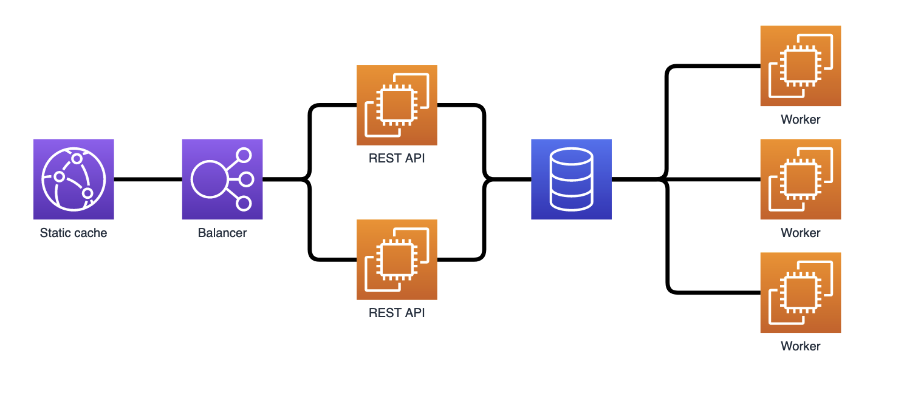

Architecture:


Run:
```bash
docker compose up
```

After that connect to the `backend` application:
```bash
docker compose exec backend bash
```

Inside the `backend` container apply DB migrations and create Django's super user:
```bash
./manage.py migrate
./manage.py create superuser
```

You can access application at http://localhost:8080.
Admin page accessible at http://localhost:8080/admin there you can create a new test user etc.

Connect to database container:
```bash
docker compose exec db bash
psql -U postgres
```

Shut down application and remove all the data:
```bash
docker compose down --volumes
```
